## 1. Introduction

In the following documentation, the **OpenText Core Software Delivery Platform** and **OpenText Software Delivery Management** will collectively be referred to as 'the product'.

This is a custom plugin which facilitates communication between Azure DevOps and the product (formerly known as ALM Octane/ValueEdge) regarding CI/CD.
The extension will monitor and reflect the pipeline activity into the product.

## 2. Table of Contents

- [1. Introduction](#1-introduction)
- [2. Table of Contents](#2-table-of-contents)
- [3. Requirements](#3-requirements)
- [4. Extension configuration](#4-extension-configuration)
    - [4.1. How to install the Azure DevOps CSDP/SDM extension from Marketplace](#41-how-to-install-the-azure-devops-csdpsdm-extension-from-marketplace)
    - [4.2. How to add an API Access Key in the product for Azure Service Connection ](#42-how-to-add-an-api-access-key-in-the-product-for-azure-service-connection)
    - [4.3. How to create a new service connection](#43-how-to-create-a-new-service-connection)
- [5. Pipeline interaction](#5-pipeline-interaction)
    - [5.1. Create a new pipeline with the CSDP/SDM start and end tasks through YAML editing (implicit Azure job)](#51-create-a-new-pipeline-with-the-csdpsdm-start-and-end-tasks-through-yaml-editing-implicit-azure-job)
    - [5.2. Create a new pipeline with the CSDP/SDM start and end tasks through classic editor (implicit Azure job)](#52-create-a-new-pipeline-with-the-csdpsdm-start-and-end-tasks-through-classic-editor-implicit-azure-job)
    - [5.3. Create a new pipeline with the CSDP/SDM start and end tasks through YAML editing (explicit Azure jobs)](#53-create-a-new-pipeline-with-the-csdpsdm-start-and-end-tasks-through-yaml-editing-explicit-azure-jobs)
- [6. Pipeline configuration for executing UFT One Tests](#6-pipeline-configuration-for-executing-uft-one-tests)
- [7. Displaying JUnit/UFT One/NUnit test results into the product](#7-displaying-junituft-onenunit-test-results-into-the-product)
    - [7.1 Displaying JUnit/UFT One/NUnit test results into the product using yml editor](#71-displaying-junituft-onenunit-test-results-into-the-product-using-yml-editor)
    - [7.2 Displaying JUnit/UFT One/NUnit test results into the product using classic editor](#72-displaying-junituft-onenunit-test-results-into-the-product-using-classic-editor)
- [8. Displaying Cucumber Gherkin test results into the product](#8-displaying-cucumber-gherkin-test-results-into-the-product)
    - [8.1. Displaying Cucumber Gherkin test results into the product using yml editor](#81-displaying-cucumber-gherkin-test-results-into-the-product-using-yml-editor)
    - [8.2. Displaying Cucumber Gherkin test results into the product using classic editor](#82-displaying-cucumber-gherkin-test-results-into-the-product-using-classic-editor)
- [9. Configuring test runner pipeline](#9-configuring-test-runner-pipeline)
    - [9.1 Test Runner for UFT One Tests](#91-test-runner-for-uft-one-tests)
    - [9.2. Configure pipeline variables](#92-configure-pipeline-variables)
- [10. Extracting parameters from CSDP/SDM service connection](#10-extracting-parameters-from-csdpsdm-service-connection)
- [11. Discovery flow for UFT One tests](#11-discovery-flow-for-uft-one-tests)
    - [11.1 Storing some steps in a separate powershell file for better readability](#111-storing-some-steps-in-a-separate-powershell-file-for-better-readability)
    - [11.2 Keeping all the steps in the pipeline](#112-keeping-all-the-steps-in-the-pipeline)
- [12. Configuring Auto Action flow](#12-configuring-auto-action-flow)
- [13. Useful Configurations](#13-useful-configurations)
    - [13.1. Running pipelines from the product](#131-running-pipelines-from-the-product)
    - [13.2. Running pipelines with variables or parameters](#132-running-pipelines-with-variables-or-parameters)
        - [13.2.1. Running pipelines with variables](#1321-running-pipelines-with-variables)
        - [13.2.2. Running pipelines with parameters](#1322-running-pipelines-with-parameters)
    - [13.3. Activating debug messages](#133-activating-debug-messages) 
- [14. Known issues and limitations](#14-known-issues-and-limitations)
- [15. Change logs](#15-change-logs)


## 3. Requirements

- At least one Azure Devops agent allocated for running the pipeline
- The Azure DevOps extension version should be **1.0.0.8** or **higher** (certain features require a newer version - see documentation)
- The product version should be **16.1.200** or **higher**
- API access to the product with **CI/CD Integration** or **DevOps Admin** roles

## 4. Extension configuration

### 4.1. How to install the Azure DevOps CSDP/SDM extension from Marketplace

1. In Azure DevOps, click on "Manage extensions":


2. Then click on click on "Browse marketplace":


3. Search for "Octane" and filter by "Azure Pipelines":


4. Click on "Get it free":


5. Choose the Azure DevOps organization you want to install this extension into and press "Install":


6. Go back to your organization by pressing the "Proceed to organization" button:


### 4.2. How to add an API Access Key in the product for Azure Service Connection

Before you can add a new service connection, please make sure you have a valid API ACCESS key and secret set in the product. You can follow the steps below to create one:

1. Firstly, go to the space and in the API Access tab press the "+ API access" button:

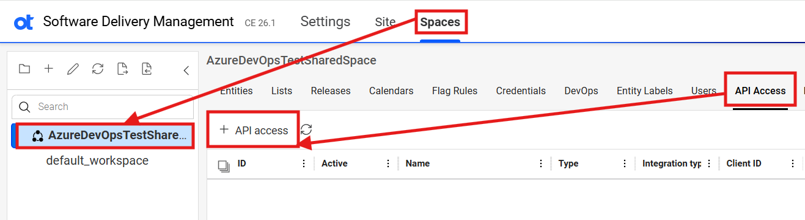

2. Fill in all required data, like name, and you need to select Credential and you can also set an expiration date, but it is not mandatory. And don’t forget to select the role for CI/CD Integration in the required workspace: 

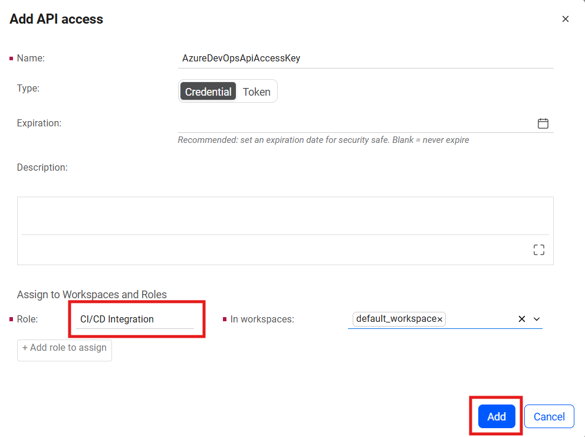

3. In the displayed popup, press copy and save your newly created API Access, but be careful, after closing this prompt, you won't be able to visualise these variables again, so it's highly recommended to save these values somewhere:

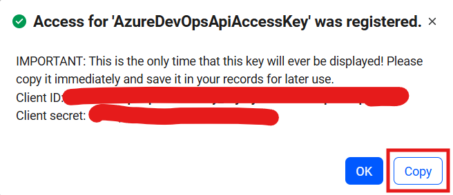

### 4.3. How to create a new service connection

1. Firstly, go back in Azure DevOps, and go to "Project settings" in the bottom left corner:


2. Click on the "Service connections" available in the "Pipeleines" tab:

\

3. Press the “Create service connection” button: 


4. Select the CSDP/SDM connection type: 

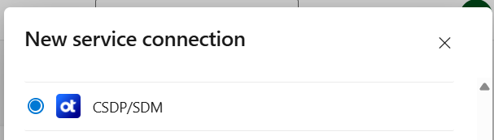

5. Fill in all fields required in the form which appears, as follows:


**Server Url** - the URL of the CSDP/SDM the service connection will point to. Make sure to include the sharedspace/workspace query parameter (p=1002/1002)

**Instance ID** - the name you expect to see in CI Servers grid in DEVOPS tab for a specific space, like in the example: 


**Authentication** - The API Access key and secret which are created inside the shared space, the creation of which was presented earlier in the guide.

**Service connection name** - The name to be used anywhere inside Azure DevOps to reference this service connection.

**Grant access permission to all pipelines** - Selecting this checkbox will make this service connection available for all pipelines for usage.

## 5. Pipeline interaction

### 5.1. Create a new pipeline with the CSDP/SDM start and end tasks through YAML editing (implicit Azure job)

1. Go to Pipelines and press Create Pipeline:


2. Select the source code repository type you use, in this case we will use the local Azure Repos Git: 


> [!NOTE]
> Note that depending on the repository type you select, there might be different steps to execute.

3. Select the actual repository: 


4. Edit your YML if you require, and press Save and Run:


5. Go to Pipelines, where you should see your new pipeline. It should be marked green, as the job succeeded:


6. Press on the pipeline and edit it:


7. Add the CSDP/SDM Job Start and CSDP/SDM Job End. You must make sure to add them together because otherwise the pipelines will not show properly in the product. Job start is required in order to create the CI Server and Pipeline in the product and mark it as running. Job end is required in order to let the product know that the pipeline ended. This should be the last task inside your Azure DevOps pipeline. Make sure you put your cursor in the right location before adding the task as it will generate a YAML task entry directly in the position where your cursor was before you click on the task.

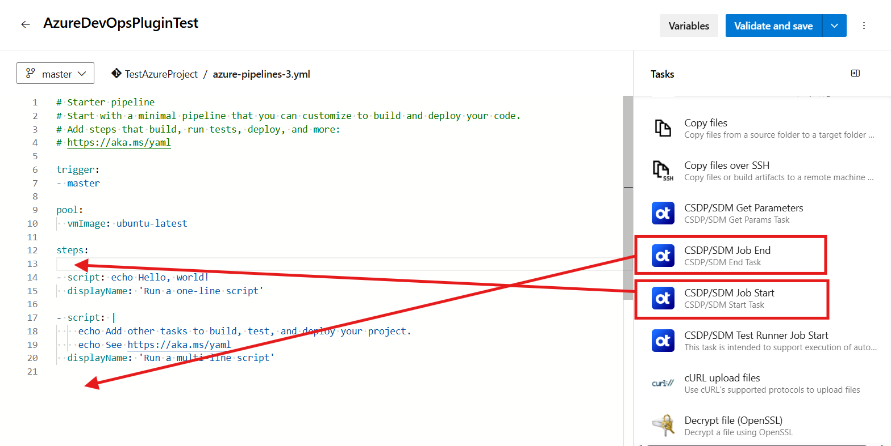

8. You need to know your workspace ID(s) within the product where you want your pipeline to be created and updated. You can find it in two ways:
    1. From the URL of the product instance you access, usually it is the second integer, as you can see from this example mock link: https://yourCSDPSDMDomain.com/ui/?p=1001/1002
    2. If you have shared space admin rights, go to Spaces within the product and press the Edit Workspace button

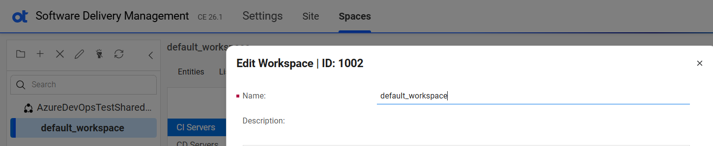

9. After finding the respective workspace id, make sure to paste it in the form that opens when you select either the start task or the end task.

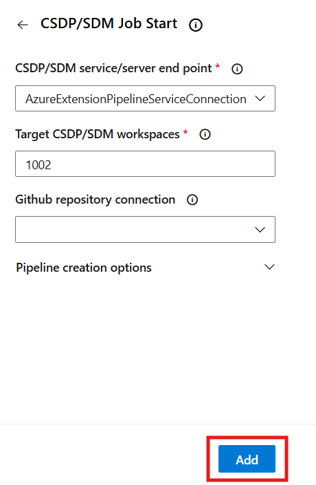

10. In the end you should have in your YAML file something like below:

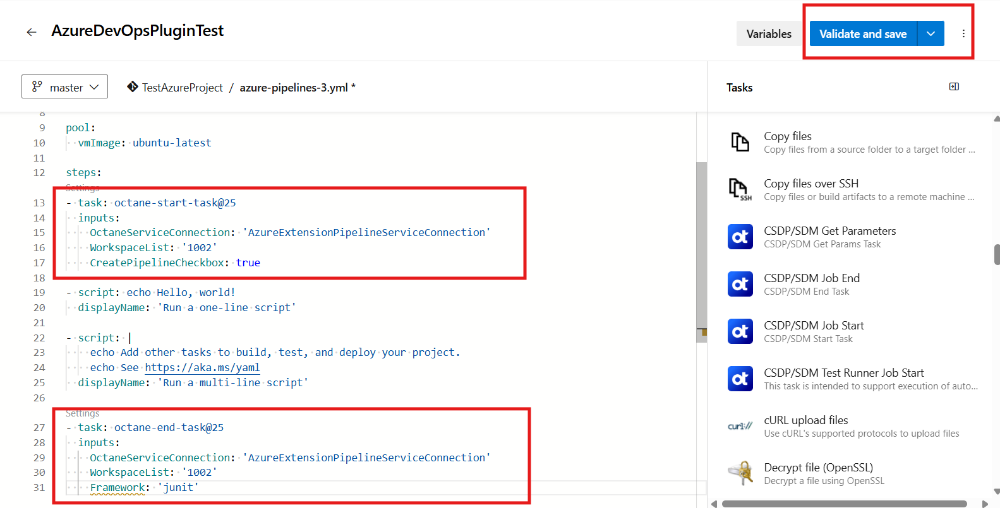

> [!CAUTION]
> For successful test and test results injections an additional parameter/variable must be set in the End task. Please refer to Chapter 7 in case of Junit, UFT One or NUnit tests ([Chapter 7.](#7-displaying-junituft-onenunit-test-results-into-the-product)) or Chapter 8 for BDD, Cucumber tests ([Chapter 8.](#8-displaying-cucumber-gherkin-test-results-into-the-product)) for more details.

> [!NOTE]
> Make sure to add the following condition inside both the start task and the end task: **condition:always()**. This will make sure that if you cancel a pipeline run, the respective run will still be replicated into the product and will appear with the status set to "Aborted". After adding this condition, the tasks should look like this:

```yaml
- task: octane-start-task@25
  condition: always()
  inputs:
    OctaneServiceConnection: 'AzureExtensionPipelineServiceConnection'
    WorkspaceList: '1002'
```

and

```yaml
- task: octane-end-task@25
  condition: always()
  inputs:
    OctaneServiceConnection: 'AzureExtensionPipelineServiceConnection'
    WorkspaceList: '1002'
```

11. Press the save button in the top right corner:


12. Execute the pipeline by pressing Run: 


13. You should observe that the job was successful, like below: 


14. If you click on the job you can see all its tasks. If you press, for example, on octanestarttask, you can observe logs indicating that the connection to the product was successful:


15. Back in the product, you can check two things that were created successfully:
    - That the pipeline was actually created
    - If you have shared space admin role, see that you have a new entry in the CI Servers grid, with the Instance ID matching the one you have previously configured: 
      
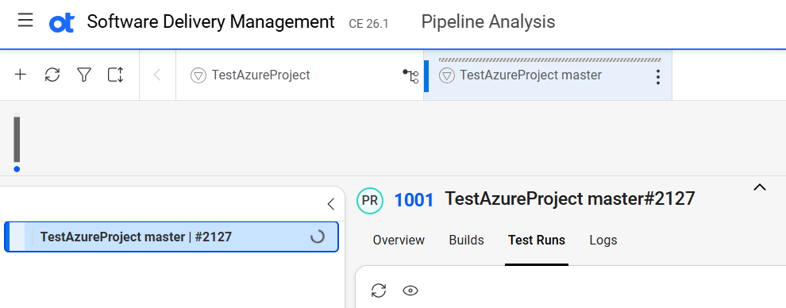

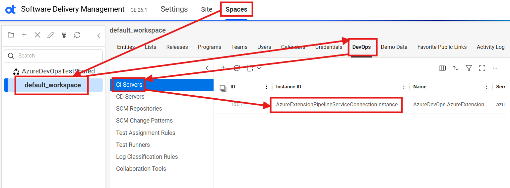

### 5.2. Create a new pipeline with the CSDP/SDM start and end tasks through classic editor (implicit Azure job)

1. Go to the Pipelines and find the hyperlink as below:


2. In the next step, choose the right team project, repository and branch:


3. Choose the right template (suppose you want a Maven configuration to build Java code):


4. Fill in all required information if default values are not satisfactory for you, and select Save:


5. Save the pipeline in a folder which you want:


6. Go to Pipelines and find your new pipeline and try to run it. You need a valid project in that repository with a valid pom.xml and surefire plugin configured, so that the actual tests are triggered and the report is published to the product.


7. Observe the execution results:


8. If you go inside the pipeline, you can observe the following:


9. When you click on the run, you should see a view similar to the one below:


10. In “Agent job 1”, press on Maven pom.xml and scroll down. You can observe:


11. The next step is to add the CSDP/SDM tasks. Go back and press “Edit” in order to edit the pipeline and add the CSDP/SDM tasks:


12. In the newly displayed view, press the plus sign on the right of “Agent Job 1” in order to reveal all possible tasks to be added: 

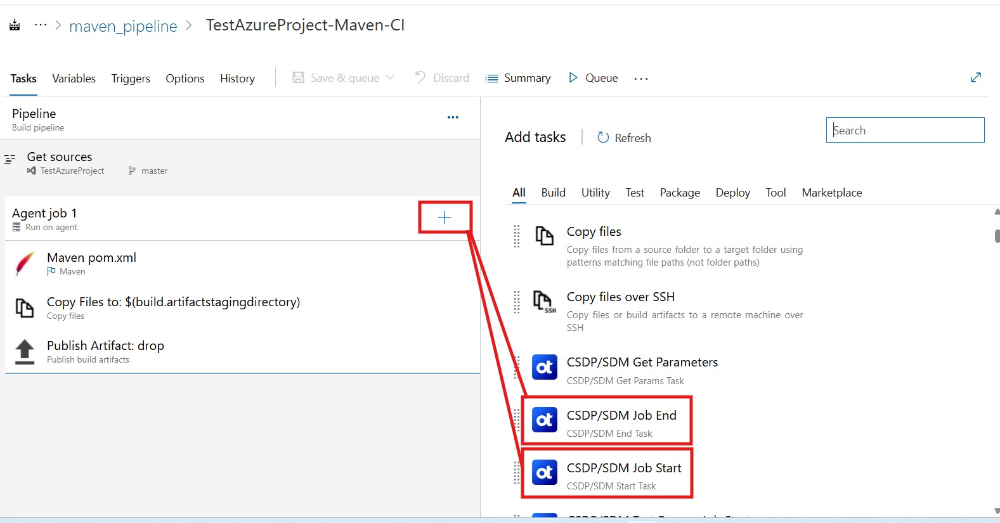

13. Add the start task:

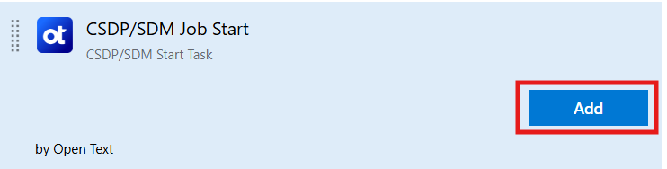

14. The task should be added to the end of the list, and now you should position it before all other tasks. Additionally, you need to configure it:

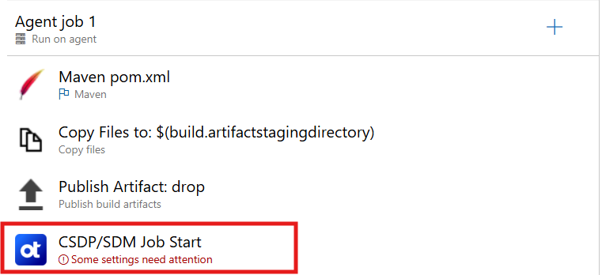

15. Click on the button on the right and configure the task:

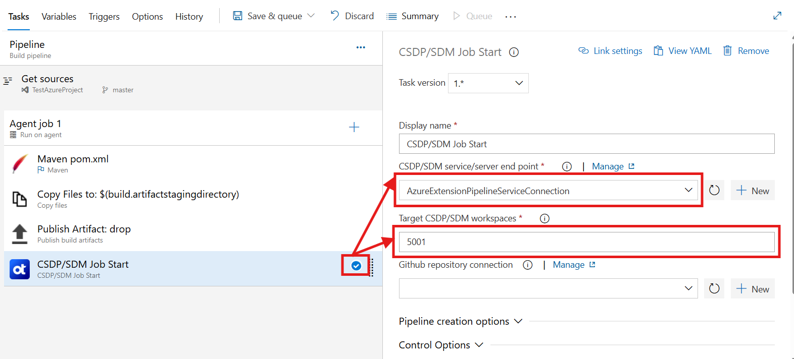

16. Drag and drop the CSDP/SDM Job Start and position it first in the list:

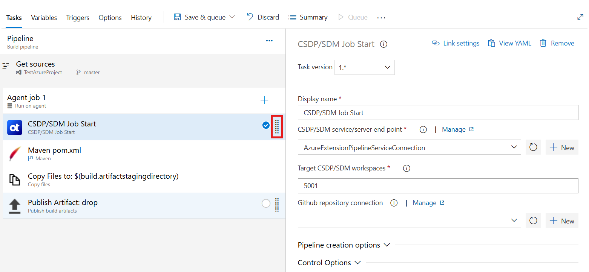

17. Do the same thing for the CSDP/SDM Job End, so that you end up with the following pipeline. Press “Save & queue”:

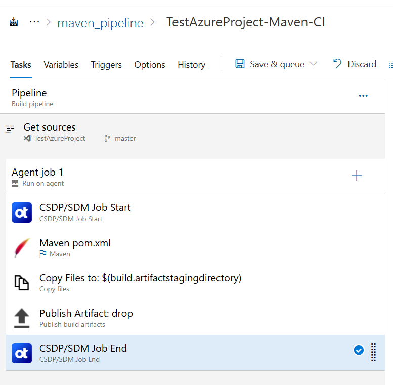

18. Add a relevant comment to the save, and press the “Save and run” button:

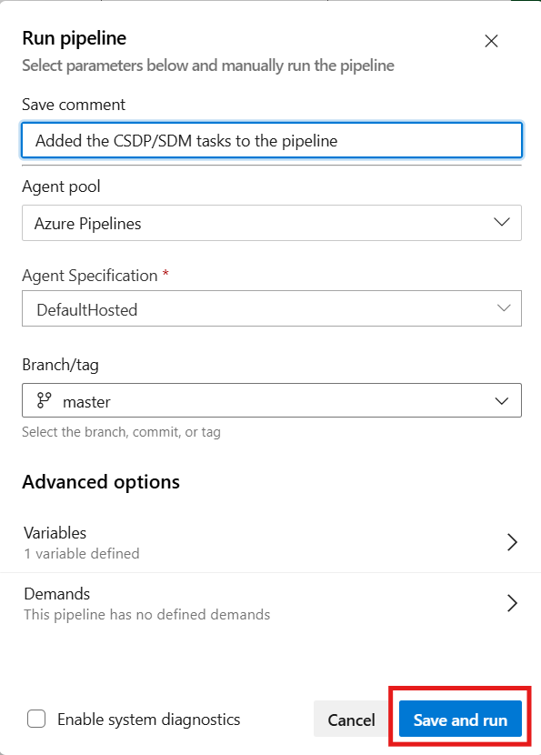

19. Wait for the pipeline to run. Then, open “Agent Job 1” and observe that you have two additional CSDP/SDM tasks that will be executed:

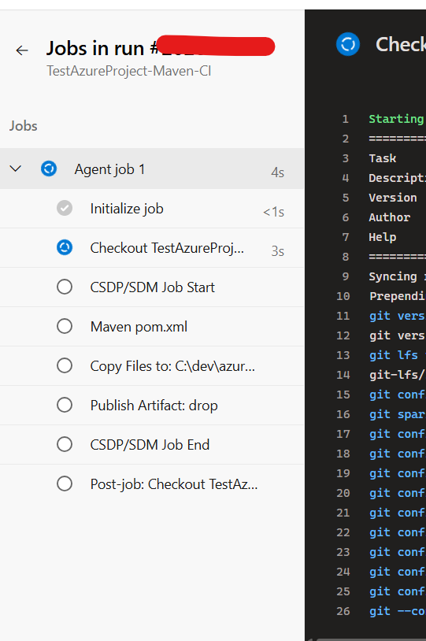

20. Now you can go to the product and verify that the pipeline was created and shows the results:

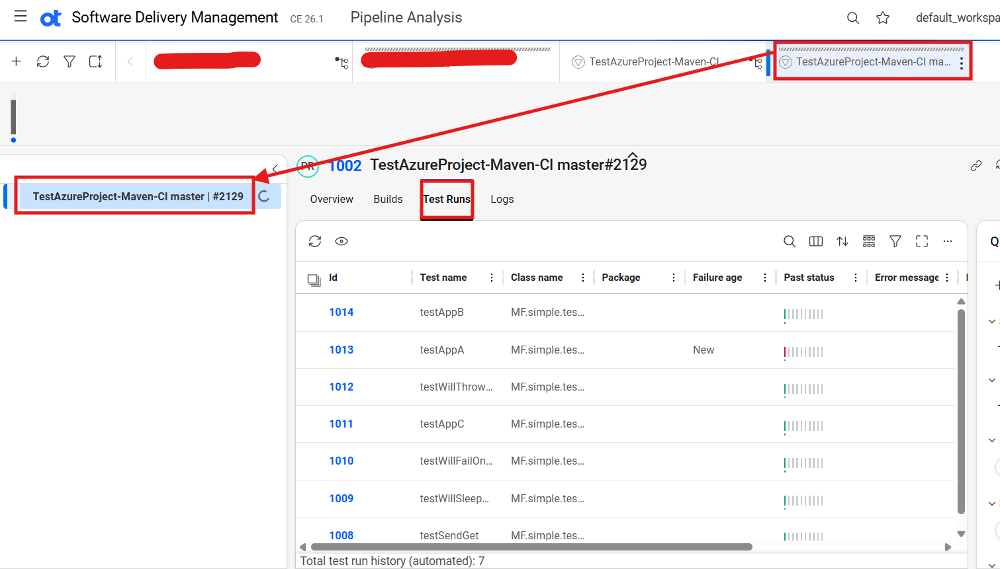

### 5.3. Create a new pipeline with the CSDP/SDM start and end tasks through YAML editing (explicit Azure jobs)

Previous chapters focused on the demonstration of how to create pipelines with CSDP/SDM tasks inside them. This is ok if you do not need complex pipelines with multiple jobs inside them, or you are just testing how the extension might fit your needs. For more complex scenarios where multiple jobs are used and the pipelines already exist, tasks under existing jobs might not be a solution. Suppose you have the following YAML, which contains a simple task of building a maven project specified under an unnamed job (in theory you might have many jobs here, but for the sake of simplicity, we will work with only one):

```yaml
# Maven
# Build your Java project and run tests with Apache Maven.
# Add steps that analyze code, save build artifacts, deploy, and more:
# https://docs.microsoft.com/azure/devops/pipelines/languages/java

trigger:
- main

jobs:
- job:
  pool: 'Default'
  steps:
  - task: Maven@3
    inputs:
      mavenPomFile: 'pom.xml'
      mavenOptions: '-Xmx3072m'
      javaHomeOption: 'JDKVersion'
      jdkVersionOption: '1.8'
      jdkArchitectureOption: 'x64'
      publishJUnitResults: true
      testResultsFiles: '**/surefire-reports/TEST-*.xml'
      goals: 'package'
```

If you want CSDP/SDM Start Task and End Task to be included as separate jobs, do the following:
1.	Give a name to your existing job (or jobs, if multiple).
2.	Add a new job at the same level as your existing job, and place your cursor on the next line after “steps:”:
   
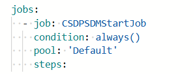

3.	Press on the CSDP/SDM Job Start to be added:

 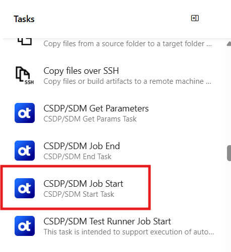

4.	Fill in the required fields (refer to previous chapters for pre-requisites, explanation, and examples):


5.	You should end up with the following block of code:


6.	Add the CSDP/SDM Job End in the same way as for start, with the difference that you need to have the “dependsOn” property set to the list of all existing jobs, including CSDP/SDM Start Job. This is required because jobs might run in parallel, and to make sure that End job runs last, we need to set the dependencies on all other jobs:

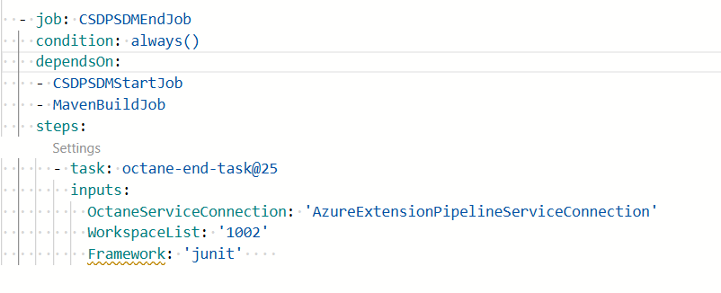

7.	As a last step, set “dependsOn” property of your jobs to depend on the CSDPSDMStartJob (or whatever name you’ve assigned to it), as follows:

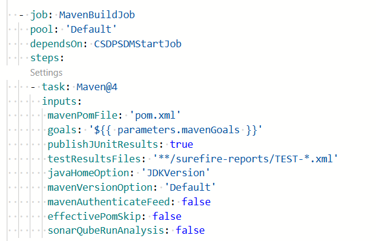

8.	In the end, you should have the YAML file similar to the one below:

```yaml
# Maven
# Build your Java project and run tests with Apache Maven.
# Add steps that analyze code, save build artifacts, deploy, and more:
# https://docs.microsoft.com/azure/devops/pipelines/languages/java

trigger:
  - master

jobs:
  - job: CSDPSDMStartJob
    condition: always()
    pool: 'Default'
    steps:
      - task: octane-start-task@25
        inputs:
          OctaneServiceConnection: 'AzureExtensionPipelineServiceConnection'
          WorkspaceList: '1002'
          CreatePipelineCheckbox: true

  - job: MavenBuildJob
    pool: 'Default'
    dependsOn: CSDPSDMStartJob
    steps:
      - task: Maven@4
        inputs:
          mavenPomFile: 'pom.xml'
          goals: '${{ parameters.mavenGoals }}'
          publishJUnitResults: true
          testResultsFiles: '**/surefire-reports/TEST-*.xml'
          javaHomeOption: 'JDKVersion'
          mavenVersionOption: 'Default'
          mavenAuthenticateFeed: false
          effectivePomSkip: false
          sonarQubeRunAnalysis: false

  - job: CSDPSDMEndJob
    condition: always()
    dependsOn:
      - CSDPSDMStartJob
      - MavenBuildJob
    steps:
      - task: octane-end-task@25
        inputs:
          OctaneServiceConnection: 'AzureExtensionPipelineServiceConnection'
          WorkspaceList: '1002'
          Framework: 'junit'

```

9.	Save and run the pipeline, and you should see something similar to below:
 
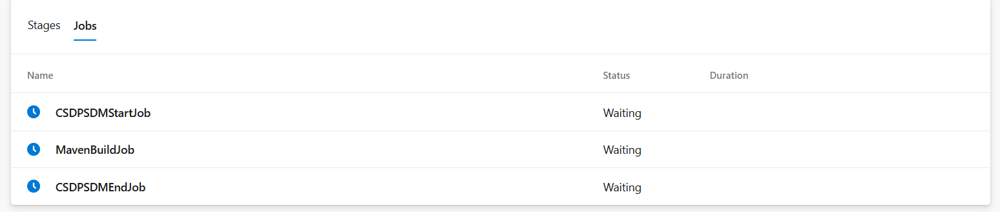

10.	Because we specified the dependencies between the jobs, CSDPSDMStartJob should run first, MavenBuildJob second, and CSDPSDMEndJob should be last:

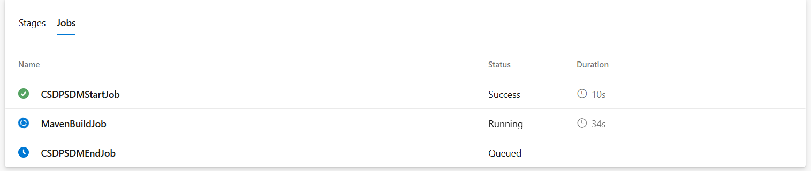

Now you can create complex scenarios with different jobs. Make sure you understand the dependencies and current limitations of the Azure DevOps pipeline and the extension.

## 6. Pipeline configuration for executing UFT One Tests
For executing UFT One tests from Azure DevOps pipelines and displaying the results into the product, the following prerequisites must be met:

1. The Azure DevOps agent must **not** be running as a service. It should be turned on using the `run.cmd` from the agent's folder.
1. OpenText Functional Testing application must be installed.
2. FToolsLauncher.exe must be in the repository used by the pipeline.
3. The following steps must be added to the pipeline between the CSDP/SDM Start and End tasks:
```yaml
- powershell: |
    Write-Host "Current Directory:"
    Get-Location
    echo "Building..."
    mkdir build
    $ESCAPED_DIR = $Env:BUILD_SOURCESDIRECTORY.Replace('\', '\\')
    Set-Content -Path ./build/Props.txt -Value "runType=FileSystem"
    Add-Content -Path ./build/Props.txt -Value "resultsFilename=build\\Results.xml"
    Add-Content -Path ./build/Props.txt -Value "Test1=$ESCAPED_DIR"
    Add-Content -Path ./build/Props.txt -Value "resultUnifiedTestClassname=true"
    Add-Content -Path ./build/Props.txt -Value "resultTestNameOnly=true"
    Get-Content -Path ./build/Props.txt
  displayName: Building 

- powershell: |
    echo "Testing..."
    echo $PWD
    Test-Path "./build/Props.txt" -PathType leaf
    Get-Content -Path ./build/Props.txt
    Start-Process "FTToolsLauncher_net48.exe" -ArgumentList "-paramfile `"$(Get-Location)\build\Props.txt`"" -Wait
    echo "Please check the [$PWD\build\Results.xml] file."
  displayName: Testing
```
The "resultsFilename=build\\Results.xml" is the path where the test results will be stored on the agent machine, this can be modified as needed.
The "Test1=$ESCAPED_DIR" is the path to the UFT One tests that will be executed, this should point to the location of the tests in the repository. This can also be modified as needed, for example,
it can point to only a specific folder or test file or multiple test folder or files, as below:
```yaml
Add-Content -Path ./build/Props.txt -Value "Test1=$ESCAPED_DIR\my_folder1\test1"
Add-Content -Path ./build/Props.txt -Value "Test2=$ESCAPED_DIR\my_folder2"
```
For the example above, only test1 from my_folder1 and all tests from my_folder2 will be executed.

## 7. Displaying JUnit/UFT One/NUnit test results into the product

### 7.1 Displaying JUnit/UFT One/NUnit test results into the product using yml editor

> [!NOTE]
> For running NUnit tests, the workaround presented in Chapter 13 (See [13. Known issues and limitations](#13-known-issues-and-limitations)), still needs to be applied, as the extension does not support NUnit framework natively.

1. Create a pipeline job for running tests.
2. Add the parameter/variable with the value of the path where the test results are stored. 
- At the beginning of the pipeline, the following parameter needs to be added:
```yaml
- parameters:
  - name: unitTestResultsGlobPattern
    type: string
    default: '**/surefire-reports/TEST-*.xml' # Path where the test results are stored
```
-  In the CSDP/SDM Job End task, we need to add the following environment variable:
```yaml
  env:
    UNIT_TEST_RESULTS_GLOB_PATTERN: ${{ parameters.unitTestResultsGlobPattern }}
```
-  In the end the pipeline should look like this:
```yaml
trigger:
- master

parameters:
  - name: mavenGoals
    type: string
    default: clean test
    values:
      - clean test
      - not clean test
  - name: unitTestResultsGlobPattern
    type: string
    default: '**/surefire-reports/TEST-*.xml'

pool: Default

steps:

- task: octane-start-task@25
  inputs:
    OctaneServiceConnection: 'AzureExtensionPipelineServiceConnection'
    WorkspaceList: '5001'
    CreatePipelineCheckbox: true

- task: Maven@4
  inputs:
    mavenPomFile: 'pom.xml'
    goals: '${{ parameters.mavenGoals }}'
    publishJUnitResults: true
    testResultsFiles: '**/surefire-reports/TEST-*.xml'
    javaHomeOption: 'JDKVersion'
    mavenVersionOption: 'Default'
    mavenAuthenticateFeed: false
    effectivePomSkip: false
    sonarQubeRunAnalysis: false
  continueOnError: true

- task: octane-end-task@25
  inputs:
    OctaneServiceConnection: 'AzureExtensionPipelineServiceConnection'
    WorkspaceList: '5001'
    Framework: 'junit'
  env: 
    UNIT_TEST_RESULTS_GLOB_PATTERN: ${{ parameters.unitTestResultsGlobPattern }}
```

In case you wish to use variables, instead of parameters, you can do it as follows:

- First, you need to define a variable with the path where the test results are stored, for example:


- Then, you need to set the environment variable in the End task as follows:

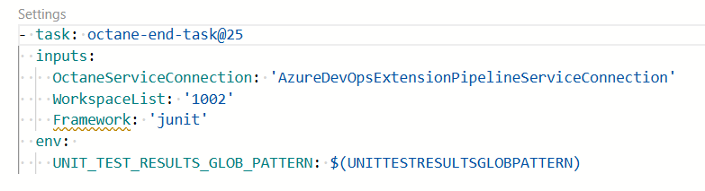

> [!CAUTION]
> The path given as a value for the UNIT_TEST_RESULTS_GLOB_PATTERN variable must be the same as the one specified in the test task, in the example above it is  "testResultsFiles: '**/surefire-reports/TEST-*.xml'". For UFT One tests, the path specified for the 'unitTestResultsGlobPattern' parameter should be the same as the one specified in the "resultsFilename" property in the Powershell task.
> If the paths do not match, the results will not be displayed in the product.

3. The results can be observed in the product in the Pipelines section:

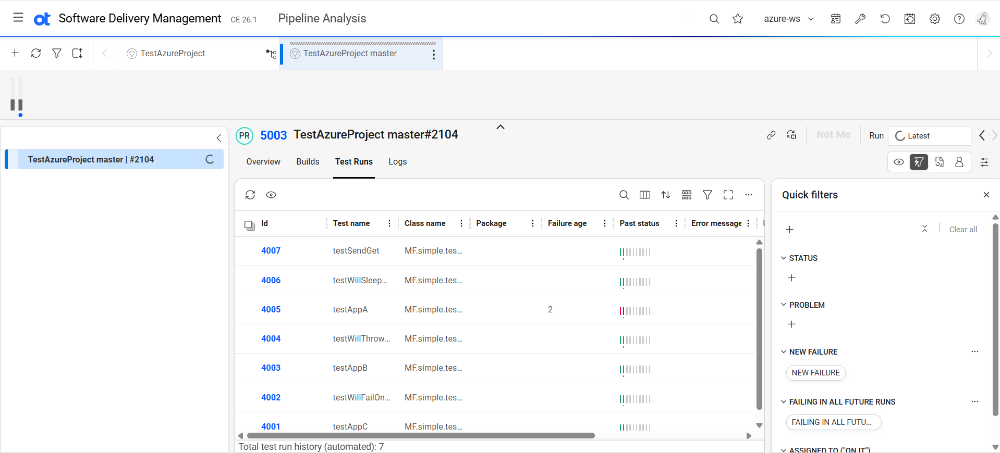

### 7.2 Displaying JUnit/UFT One/NUnit test results into the product using classic editor

1. Create the CSDP/SDM Start and End tasks as explained in the previous chapters.
2. Click on the Variables tab and add new variable "unitTestResultsGlobPattern" and set its value to the path where the test results are stored, for example: '**/surefire-reports/TEST-*.xml'.

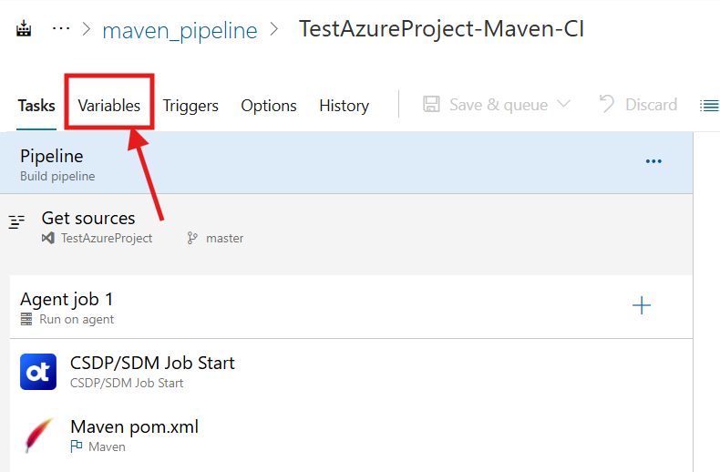

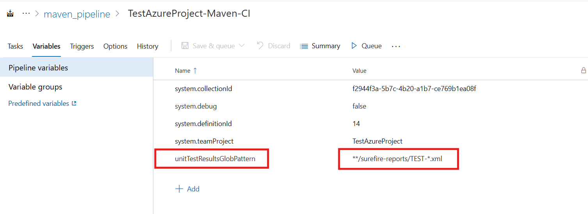

3. In the Maven task, make sure that the path where the test results are stored is specified in the "Test results files" field, for example: '**/surefire-reports/TEST-*.xml'. This should have the same value as the one specified for the variable "unitTestResultsGlobPattern".

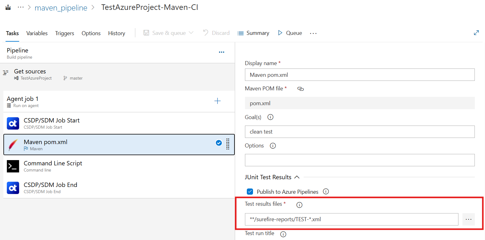

4. Then add a new Command Line task to set the environment variable for the End task, and make sure to position it before the End task:

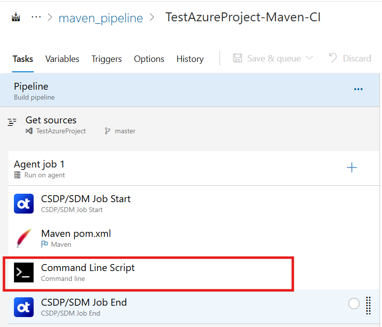

5. In the command line task, add the following:

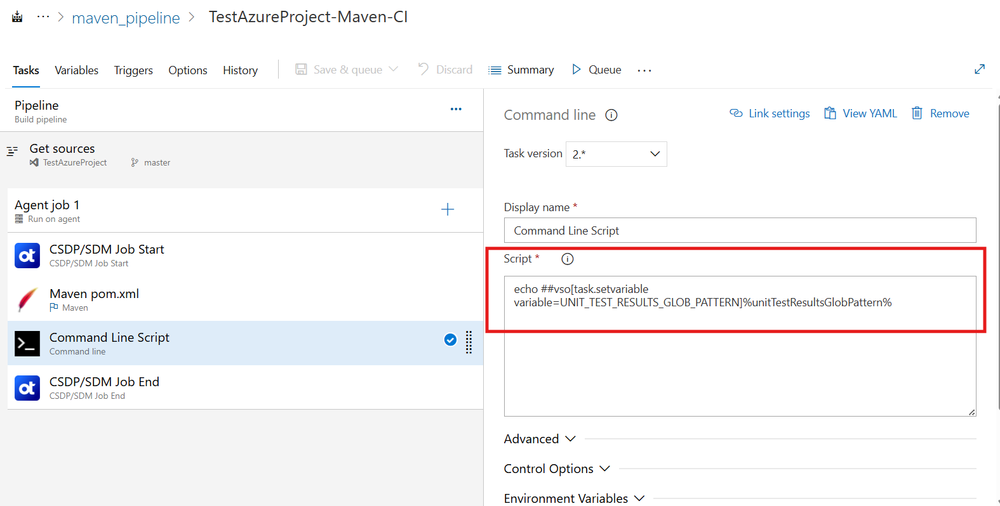

6. The results can be observed in the product in the Pipelines section:

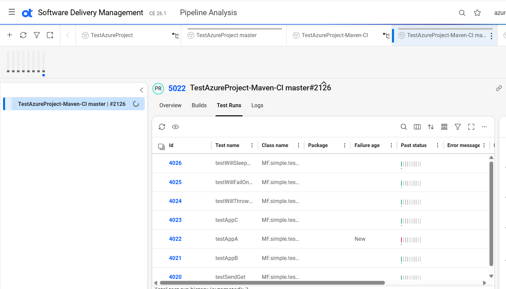

## 8. Displaying Cucumber Gherkin test results into the product

### 8.1. Displaying Cucumber Gherkin test results into the product using yml editor

1. Create a pipeline job for running the tests.

2. Needed steps based of the Cucumber version you are using:

> [!IMPORTANT]
> Starting with Cucumber JVM versions 4.8.1+ you should use the bdd2octane tool which supports multiple BDD frameworks including Cucumber 5.x and later. See https://github.com/MicroFocus/bdd2octane.

If you are using 4.8.1+ versions, you need to have the following steps in the pipeline configuration:

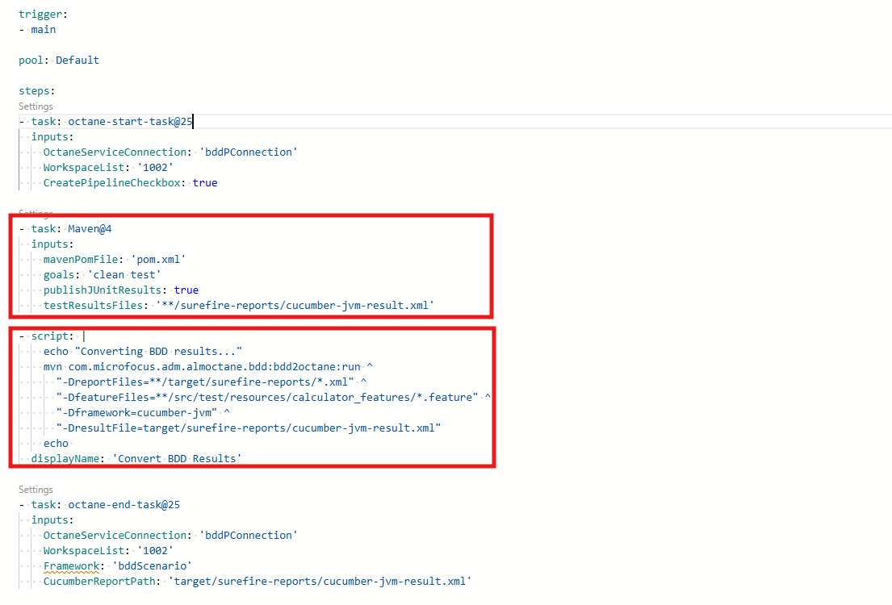

In the CSDP/SDM Job End task, you need to set the Cucumber report destination path with the same value as you have in the `-DresultFile`  in the previous step, as shown in the example above.

In the end your pipeline should look like this:
```yaml
trigger:
- main

pool: Default

steps:
- task: octane-start-task@25
  inputs:
    OctaneServiceConnection: 'bddPConnection'
    WorkspaceList: '1002'
    CreatePipelineCheckbox: true

- task: Maven@4
  inputs:
    mavenPomFile: 'pom.xml'
    goals: 'clean test'

- script: |
    echo "Converting BDD results..."
    mvn com.microfocus.adm.almoctane.bdd:bdd2octane:run ^
      "-DreportFiles=**/target/surefire-reports/*.xml" ^
      "-DfeatureFiles=**/src/test/resources/calculator_features/*.feature" ^
      "-Dframework=cucumber-jvm" ^
      "-DresultFile=target/surefire-reports/cucumber-jvm-result.xml"
    echo 
  displayName: 'Convert BDD Results'

- task: octane-end-task@25
  inputs:
    OctaneServiceConnection: 'bddPConnection'
    WorkspaceList: '1002'
    Framework: 'bddScenario'
    CucumberReportPath: 'target/surefire-reports/cucumber-jvm-result.xml'
```

If you are using older versions of Cucumber, you can use the OctaneGherkinFormatter, and for that you need to have the following steps in the pipeline configuration, containing the Maven task to use the OctaneGherkinFormatter when running the tests, and where to store the results as below. The formatter specifies the location and name of the generated xml file containing the report.

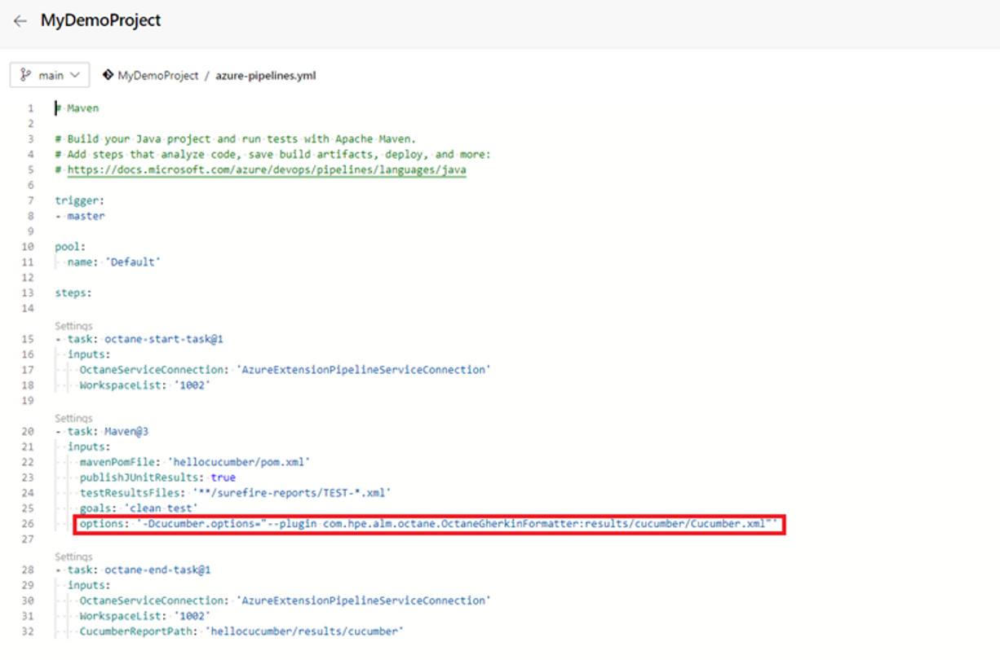

Fill in the Cucumber report destination path field when configuring the CSDP/SDM Job End task. This must point to the same directory as specified for the GherkinFormatter. Note that the path must be filled in starting with the source code repo root directory.

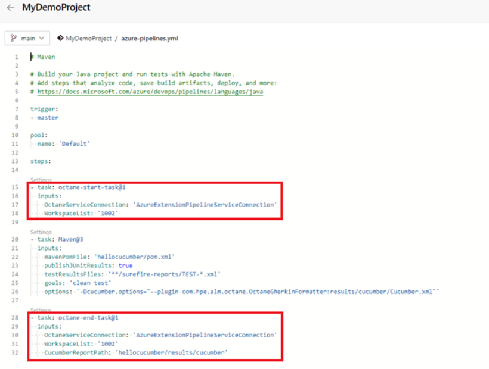

3. Run the pipeline and check if all steps have been completed successfully. The End Job task should display the fact that the test results have been found and processed.

4. The results can be observed in the product in the Pipelines section:

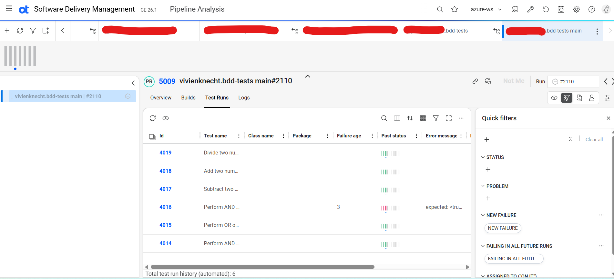

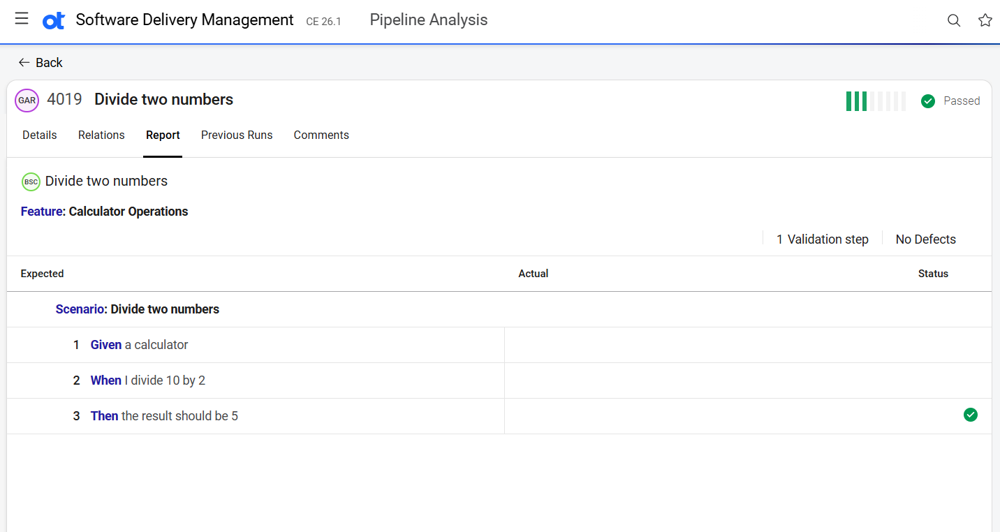

### 8.2. Displaying Cucumber Gherkin test results into the product using classic editor

1.	Create a pipeline job for running the tests.
2. Needed steps based of the Cucumber version you are using:

> [!IMPORTANT]
> Starting with Cucumber JVM versions 4.8.1+ you should use the bdd2octane tool which supports multiple BDD frameworks including Cucumber 5.x and later. See https://github.com/MicroFocus/bdd2octane.

If you are using 4.8.1+ versions, you need to have the following steps in the pipeline configuration:
First you need to add the Maven task:


Then you need to add a Command Line task to convert the results using the bdd2octane tool:

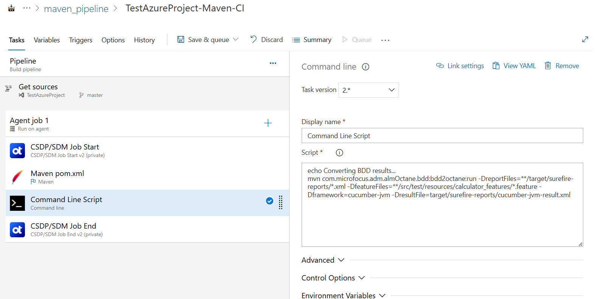

In the CSDP/SDM Job End task, you need to set the Cucumber report destination path with the same value as you have in the `-DresultFile`  in the previous step, as shown in the example below:

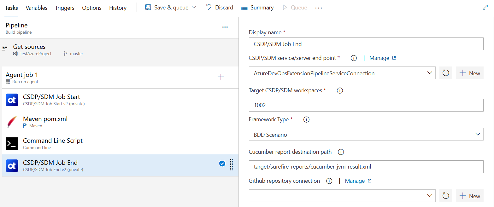

If you are using older versions of Cucumber, you can use the OctaneGherkinFormatter, and for that you need to have the following steps in the pipeline configuration, containing the Maven task to use the OctaneGherkinFormatter when running the tests, and where to store the results as below. The formatter specifies the location and name of the generated xml file containing the report.

Make sure to configure the Maven task to use the OctaneGherkinFormatter when running the tests, and where to store the results as below. The formatter specifies the location and name of the generated xml file containing the report.

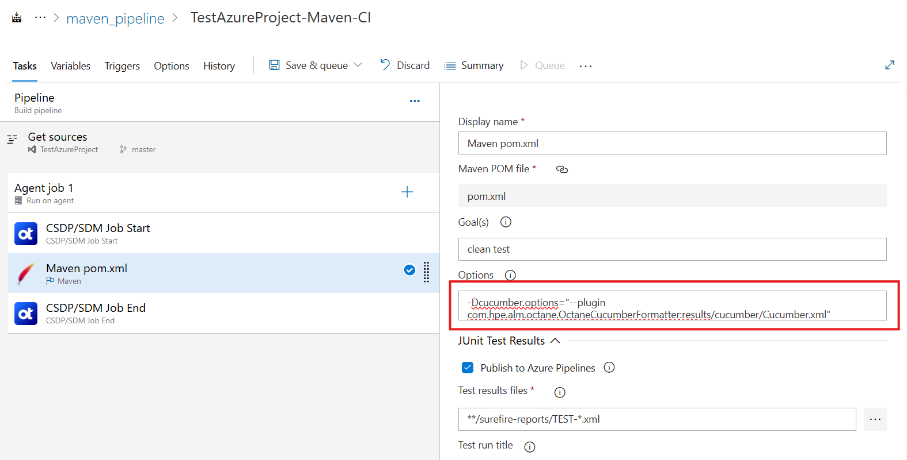

Fill in the Cucumber report destination path field when configuring the CSDP/SDM Job End task. This must point to the same directory as specified for the GherkinFormatter. Note that the path must be filled in starting with the root directory of the project.

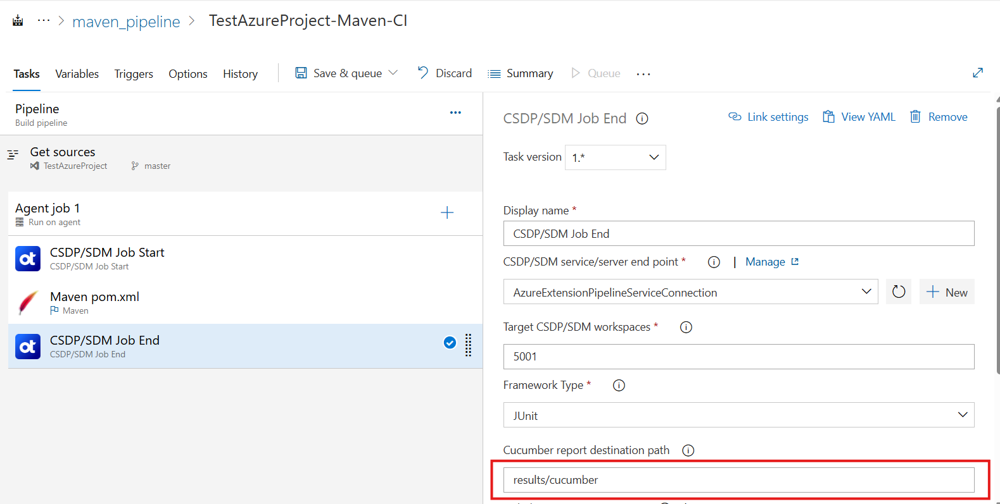

3. Run the pipeline and check if all steps have been completed successfully. The End Job task should display the fact that the test results have been found and processed.

4. The results can be observed in the product in the Pipelines section:


## 9. Configuring test runner pipeline

Besides pipeline runs, you can also configure test runners using this extension, by making use of the **octane-test-runner-start-task@1**. Naturally you will not be creating another pipeline in the product, but rather a test runner that you can assign test suites to and run them from the product and see the results in both Azure DevOps and the product. To do that you need to follow the next steps:

1. Firstly, as in the previous steps, you need to create a new pipeline:


2. Choose your desired source code repository option, but keep in mind that there might be different steps to execute, depending on the repository type you selected.


3. Select the actual repository:


4. Edit your yml file if you need to do so, and press the Save and Run:


5. Go to Pipelines, where you should see your new pipeline:


6. Press on the pipeline and edit it:


7. Here is where things are a bit different. Instead of selecting the usual octane-start-task, make sure to select the **CSDP/SDM Test Runner Job Start** task. Make sure you put your cursor in the right location before adding the task as it will generate a YAML task entry directly in the position where your cursor was before you click on the task.

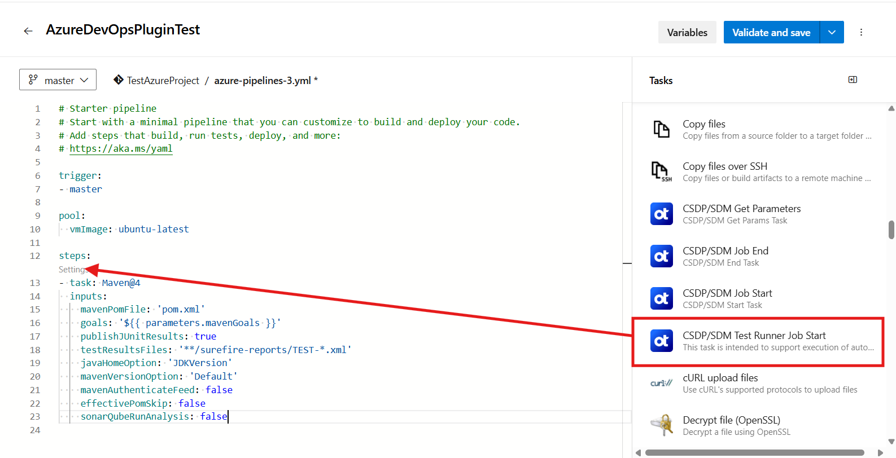

8. You will need to have an existing service connection, to know your workspace id and also select a framework convert type that best suits your needs:

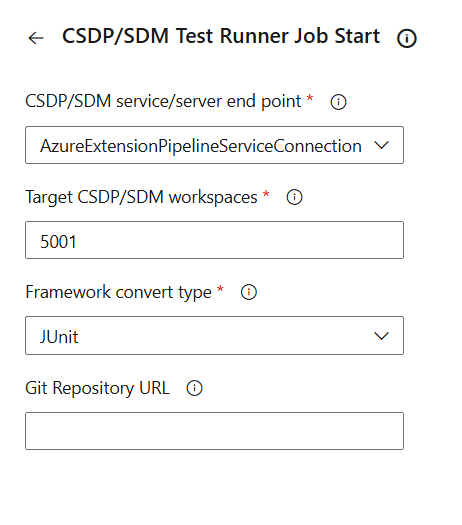

Normally you should end up with something like this. The end task remains the same

```yaml
- task: octane-test-runner-start-task@25
  inputs:
    OctaneServiceConnection: 'AzureExtensionPipelineServiceConnection'
    WorkspaceList: '5001'
    Framework: 'junit'
```

9. Make sure to save the modifications.

### 9.1 Test Runner for UFT One Tests

In case you are configuring the CSDP/SDM Test Runner Job Start task for UFT One tests, you need to do two additional steps:

1. You need to complete the "Git Repository URL" input field with the URL of the repository where your tests are located. 
```yaml
- task: octane-test-runner-start-task@25
  inputs:
    OctaneServiceConnection: 'AzureDevOpsExtensionPipelineServiceConnection'
    WorkspaceList: '1002'
    Framework: 'uft'
    GitRepositoryURL: 'https://github.com/username/repository'
```

2. In the step configuring the Props.txt file you need to add two additional lines to only run the selected tests from the product:
```yaml
- powershell: |
      Write-Host "Current Directory:"
      Get-Location
      echo "Building..."
      mkdir build
      $ESCAPED_DIR = $Env:BUILD_SOURCESDIRECTORY.Replace('\', '\\')
      Set-Content -Path "./build/testsToRun.mtbx" -Value $env:testsToRunConverted -Encoding UTF8
      Set-Content -Path ./build/Props.txt -Value "runType=FileSystem"
      Add-Content -Path ./build/Props.txt -Value "resultsFilename=build\\Results.xml"
      Add-Content -Path ./build/Props.txt -Value "Test1=$ESCAPED_DIR\\build\\testsToRun.mtbx"
      Add-Content -Path ./build/Props.txt -Value "resultUnifiedTestClassname=true"
      Add-Content -Path ./build/Props.txt -Value "resultTestNameOnly=true"
      Get-Content -Path ./build/Props.txt
```

### 9.2 Configure Pipeline Variables

1. Ensure the following variables are defined in your Azure DevOps pipeline for automated test execution:

> [!NOTE]
> If you are having trouble configuring variables, please refer to [13.2.1 Running pipelines with variables](#1321-running-pipelines-with-variables)

 - `testsToRun` (type: string)
 - `suiteId` (type: number)
 - `suiteRunId` (type: number)
 - `executionId` (type: number)
 - For numerical variables, it is recommended to set a default value of `0`.

2. Configure the `testsToRun` Conversion. To run the selected tests, configure a job or step to convert the testsToRun value into the format required by your test framework. This logic should be handled in your test automation setup. For reference: [@opentext/sdp-sdm-tests-to-run-conversion](https://github.com/MicroFocus/sdp-sdm-tests-to-run-conversion?tab=readme-ov-file#42-running-the-tool-with-github-actions)

3. Run the pipeline. After the run was completed, you should see a new test runner instance in the product, in the Spaces tab, in your workspace in the DevOps tab:

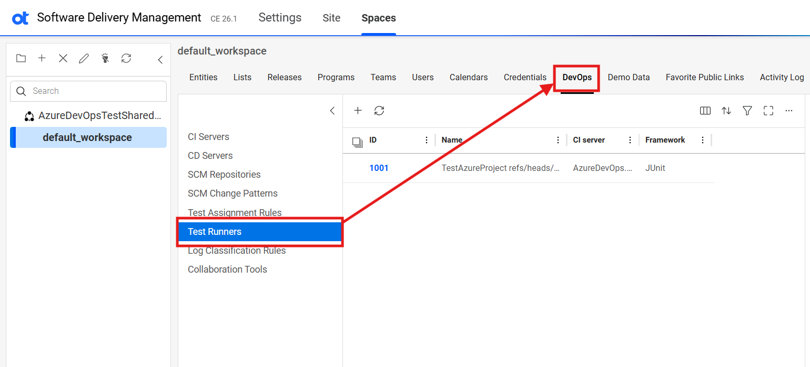

From here the possibilities depend on your needs. For example, you can assign multiple tests to a test suite and assign that test suite to the test runner. This way, you can run those tests from the product via the test runner and see the results in Azure DevOps. For more details on how to do that, make sure to check the documentation on test suites and test runner: 

https://admhelp.microfocus.com/valueedge/en/latest/Online/Content/UserGuide/how_create_test_suites.htm

> [!CAUTION]
If any of the previous steps failed, and you aren't able to run the test runner pipeline in Azure Devops, make sure that in Azure project settings, in the **Settings** tab, set "Limit variables that can be set at queue time" to **OFF**. This setting is used to enforce a "whitelist" mechanism that blocks calls from external sources if they contain variables that are not added to the whitelist. In the eventuality that you aren't allowed to modify this setting, you will need to add all the following variables in your pipeline definition file and check the "Let users override this value when running this pipeline":
> - octaneTestRunnerFramework
> - octaneSpaceId
> - octaneEnvironment
> - octaneWorkspaceId
> - octaneRunByUsername
> 
> These variables are automatically sent by the product to all other supported CI integrations, and if they are not whitelisted while this setting is enabled, the pipeline run will fail.


## 10. Extracting parameters from CSDP/SDM service connection

In some cases, you might want to extract parameters from the service connection in order to use them in your pipeline. To do that, you can use the CSDP/SDM Get Parameters task.

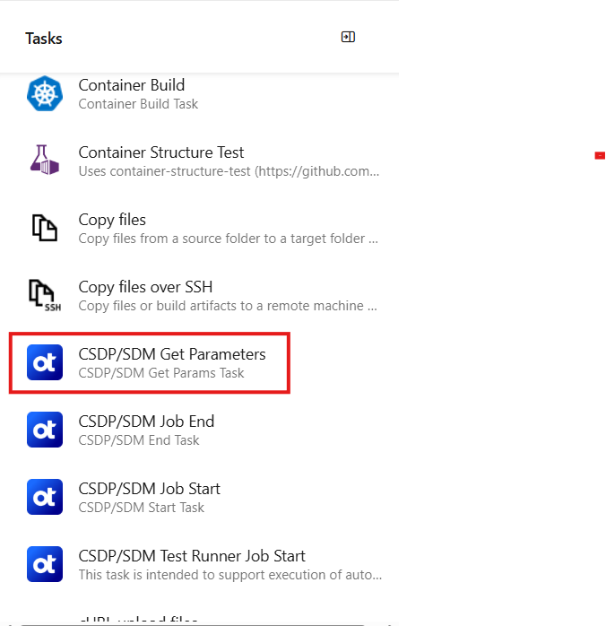

This will extract the following parameters: URL, Client ID, Client Secret and Shared Space ID, and will make them available for usage in the subsequent tasks. For example, you can use the extracted URL and Client ID to trigger API calls to the product from your pipeline. The parameters will be extracted as environment variables with the following names:
```yaml
- task: octane-get-params-task@25
  inputs:
    OctaneServiceConnection: 'AzureExtensionPipelineServiceConnection'

- script: |
    echo $(octaneUrl)
    echo $(octaneSharedSpaceId)
    echo $(octaneClientId)
    echo $(octaneClientSecret)
```

> ![NOTE]
> The values for the Client ID and Client Secret will be masked in the logs for security reasons.

## 11. Discovery flow for UFT One tests

The discovery of UFT One tests means scanning the given repository for UFT One tests and data tables and then creating them in the product. 
This can be done by using the "@opentext/sdp-sdm-test-runner-utilities" tool, which provides a function for the discovery of UFT One tests. For more details refer the documentation [here](https://github.com/MicroFocus/sdp-sdm-test-runner-utilities).

> [!CAUTION]
> When the first scan is performed for a repository, before running the tool, you need to run the CSDP/SDM Test Runner Job Start task (See [here](#9-configuring-test-runner-pipeline)) for a successful discovery of OpenText Functional Testing tests and data tables.

In order to be able to get the changes between commits, you need to track the changed files between commits, publish an artifact at the end of the pipeline with the last successful commit and download it at the beginning of the file.
The steps to achieve this behavior are presented below, and you can choose to implement them in the same pipeline file or store some of the steps in a separate powershell file for better readability.
The two options for pipeline configuration are presented in the sections below:

### 11.1 Storing some steps in a separate powershell file for better readability

1. You need to create a new folder in your repository and add a new powershell file, for example: `eng/detect-changed-files.ps1`.
2. The content of the file should be the following:

```bash
Write-Host "=== Detect changed files since last successful run ==="

$workspace     = $env:PIPELINE_WORKSPACE
$currentCommit = $env:BUILD_SOURCEVERSION.Trim()  # trim whitespace

$artifactPath = Join-Path $workspace "last-successful"
$commitFile   = Join-Path $artifactPath "last_successful_commit.txt"

# resolve baseline commit
if (Test-Path $commitFile) {
    $lastCommit = (Get-Content $commitFile -Raw).Trim()  # trim whitespace/newlines
    Write-Host "Found last successful commit: $lastCommit"
}
else {
    $lastCommit = "$currentCommit^"
    Write-Host "No previous successful run found. Using fallback commit: $lastCommit"
}

Write-Host "##vso[task.setvariable variable=LAST_SUCCESSFUL_COMMIT]$lastCommit"

# ensure full git history
git fetch --all --prune

Write-Host "Diffing $lastCommit -> HEAD"

$files = git diff --name-status -M -z $lastCommit HEAD
if (-not $files) { $files = "" }

$path = "$env:PIPELINE_WORKSPACE/modified_files.bin"

# write safely
[System.IO.File]::WriteAllBytes(
    $path,
    [Text.Encoding]::UTF8.GetBytes($files)
)

Write-Host "Modified files written to $path"

# persist current commit for next run
$currentCommit | Out-File "last_successful_commit.txt" -Encoding ascii

```

3. In the pipeline you should have the following steps:

- First, you need to run the CSDP/SDM Test Runner Job Start task to create the test runner and the SCM repository in **the product**:

```yaml
- task: octane-test-runner-start-task@25
  inputs:
    OctaneServiceConnection: "octaneConnectionForDiscovery"
    WorkspaceList: "1002"
    Framework: "uft"
    GitRepositoryURL: "https://github.com/username/repository"
```

- Checkout the repository and download the complete Git history:

```yaml
- checkout: self
  fetchDepth: 0
```

> [!CAUTION]
> The following step needs to be added only after the pipeline ran successfully once with the other steps and the artifact with the last successful commit is published, otherwise the step will fail as there is no artifact to download.

```yaml
- task: DownloadPipelineArtifact@2
  inputs:
    buildType: "specific"
    project: "$(System.TeamProjectId)"
    definition: "$(System.DefinitionId)"
    buildVersionToDownload: "latestFromBranch"
    branchName: "$(Build.SourceBranch)"
    artifactName: "last-successful"
    downloadPath: "$(Pipeline.Workspace)\\last-successful"
  displayName: "Download last successful commit SHA"
```

- After downloading the artifact (in the following runs after the first successful run), you can run the powershell file created at the previous steps to get the list of changed files between the last successful commit and the current commit.

```yaml
- powershell: |
    ./eng/detect-changed-files.ps1
  displayName: Detect changed files since last successful run
```

- The next step is retrieving the values of the parameters which will be used for the OpenText Functional Testing test discovery, using the CSDP/SDM Get Parameters task to securely retrieve the parameters from the earlier configured service connection:

```yaml
- task: octane-get-params-task@25
  inputs:
    OctaneServiceConnection: "octaneConnectionForDiscovery"
```

- Then we will run the tool with the parameters provided in the previous step and also with the MODIFIED_FILES_PATH and REPOURL environment variables which are **required** for the tool to be able to read the changed files and the repository URL:

```yaml
- powershell: |
    npx @opentext/sdp-sdm-test-runner-utilities --action="discoverTests" --isFullScan=true --path="$env:BUILD_SOURCESDIRECTORY" --octaneUrl="$(octaneUrl)" --sharedSpace="$(octaneSharedSpaceId)" --workspace="$env:WORKSPACE" --clientSecret="$(octaneClientSecret)" --clientId="$(octaneClientId)"
  env:
    MODIFIED_FILES_PATH: $(Pipeline.Workspace)/modified_files.bin
    REPOURL: $(Build.Repository.Uri)
  displayName: Discovery
```

- The next step is storing the current commit SHA as the last successful commit in the `last_successful_commit.txt` file. The SHA of the current commit will be stored in the last_successful_commit.txt which will be published as an artifact. Then in the next run, it will be downloaded and compared to the current commits SHA to get the changed files.

```yaml
- powershell: |
    echo $(Build.SourceVersion) > last_successful_commit.txt
  displayName: "Store current commit SHA"
```

- The last step to conclude the discovery process is publishing the artifact with the last successful commit.

```yaml
- publish: last_successful_commit.txt
  artifact: last-successful
  displayName: "Publish last successful commit SHA"
```

### 11.2 Keeping all the steps in the pipeline

For keeping all the steps in the pipeline, you can follow the same steps as in the previous section, but instead of storing some of the steps in a separate powershell file, you can keep them all in the pipeline, like in the example below:

> [!IMPORTANT]
> The step downloading the artifact with the last successful commit needs to be added only after the pipeline run successfully once with the other steps and the artifact with the last successful commit is published, otherwise the step will fail as there is no artifact to download.

```yaml
trigger:
  - main

pool: Default

steps:
  - task: octane-test-runner-start-task@25
    inputs:
      OctaneServiceConnection: "octaneConnectionForDiscovery"
      WorkspaceList: "1002"
      Framework: "uft"
      GitRepositoryURL: "https://github.com/username/repository"

  - checkout: self
    fetchDepth: 0

  - task: DownloadPipelineArtifact@2
    inputs:
      buildType: "specific"
      project: "$(System.TeamProjectId)"
      definition: "$(System.DefinitionId)"
      buildVersionToDownload: "latestFromBranch"
      branchName: "$(Build.SourceBranch)"
      artifactName: "last-successful"
      downloadPath: "$(Pipeline.Workspace)\\last-successful"
    displayName: "Download last successful commit SHA"

  - powershell: |
      Write-Host "=== Detect changed files since last successful run ==="

      $workspace     = $env:PIPELINE_WORKSPACE
      $currentCommit = $env:BUILD_SOURCEVERSION.Trim()

      $artifactPath = Join-Path $workspace "last-successful"
      $commitFile   = Join-Path $artifactPath "last_successful_commit.txt"

      # resolve baseline commit
      if (Test-Path $commitFile) {
          $lastCommit = (Get-Content $commitFile -Raw).Trim()
          Write-Host "Found last successful commit: $lastCommit"
      }
      else {
          $lastCommit = "$currentCommit^"
          Write-Host "No previous successful run found. Using fallback commit: $lastCommit"
      }

      Write-Host "##vso[task.setvariable variable=LAST_SUCCESSFUL_COMMIT]$lastCommit"

      # Ensure full git history
      git fetch --all --prune

      Write-Host "Diffing $lastCommit -> HEAD"

      $files = git diff --name-status -M -z $lastCommit HEAD
      if (-not $files) { $files = "" }

      $path = "$env:PIPELINE_WORKSPACE/modified_files.bin"

      [System.IO.File]::WriteAllBytes(
          $path,
          [Text.Encoding]::UTF8.GetBytes($files)
      )

      Write-Host "Modified files written to $path"

      # Persist current commit for next run
      $currentCommit | Out-File "last_successful_commit.txt" -Encoding ascii
    displayName: "Detect changed files since last successful run"

  - task: octane-get-params-task@25
    inputs:
      OctaneServiceConnection: "octaneConnectionForDiscovery"

  - powershell: |
      npx @opentext/sdp-sdm-test-runner-utilities --action="discoverTests" --isFullScan=true --path="$env:BUILD_SOURCESDIRECTORY" --octaneUrl="$(octaneUrl)" --sharedSpace="$(octaneSharedSpaceId)" --workspace="$env:WORKSPACE" --clientSecret="$(octaneClientSecret)" --clientId="$(octaneClientId)"
    env:
      MODIFIED_FILES_PATH: $(Pipeline.Workspace)/modified_files.bin
      REPOURL: $(Build.Repository.Uri)
    displayName: Discovery

  - powershell: |
      echo $(Build.SourceVersion) > last_successful_commit.txt
    displayName: "Store current commit SHA"

  - publish: last_successful_commit.txt
    artifact: last-successful
    displayName: "Publish last successful commit SHA"
```

## 12. Configuring Auto Action flow

In the product, you can add automatic actions to your release process that trigger common tasks, such as running your Azure DevOps pipeline from the product. For more details on how to configure such an auto action flow, please refer to https://admhelp.microfocus.com/valueedge/en/latest/Online/Content/UserGuide/release-process-autoactions.htm?

> [!CAUTION]
> In order to successfully schedule such an auto action, you will need to configure the following parameter in your Azure pipeline configuration file

```yaml
  - name: octane_auto_action_execution_id
    type: string
    displayName: "Octane auto action execution id"
    default: ''
```

This parameter is used in the background by the product for the pipeline results injection flow. You will notice that when configuring the auto action window, the parameter will not appear. This is intentional, because this parameter is not customizable or settable by the user, so it is hidden. In case the user will not configure this additional parameter, the following error message will appear:


## 13. Useful configurations

### 13.1 Running pipelines from the product

1. In order to start runs from the product, you need to do some additional configuration steps. First of all, in Azure DevOps you need to go to: User settings -> Personal access tokens:


2. We will need to generate such a token, with the corresponding rights, in order to be able to run the pipeline from the product. Press on the "New Token" button


3. Make sure to name this token and also in the **Scopes** tab, in the **Build** subsection, select the **Read & execute** rights, and then press Create


4. Copy the generated value, and make sure you save it somewhere as we will need it in the next steps:


5. Go back to the product, in the **Spaces** tab, select the workspace you associtated your pipeline with, then select the **Credentials** tab:


6. Go ahead and press the **+ Credentials** button and then paste the value generated by the Personal access token from Azure DevOps into the password field. You can name this credentials instance as you see fit:

> [!NOTE]
The **User Name** field does not have any correlation with any usernames that you use to login to either Azure DevOps, or the product. It doesnt have any impact on how the credentials get stored, so you can name it however you see fit.


7. Then go to the **DevOps** section where your CI Server instance should be visible. The next step would be to set the recently created Credentials to your CI Server, in order to be able to run your pipelines from the product. By default, the **Credential** column is not visible so you need to make it so:


8. You should now see an additional empty column. Make sure to double click on that empty value, and a dropdown should open. Select your recently created credential:


9. Now you can go back in the **Pipelines** in the product, select the **3 points icon** from the pipeline you want to run and then press **Run**. You should then be able to see your run in Azure DevOps.

### 13.2. Running pipelines with variables or parameters

Azure DevOps pipelines support both parameters and variables to make your workflows more dynamic, reusable, and configurable: 

- Parameters are defined at the top of a YAML template or pipeline and are evaluated at compile-time. They are strongly typed (string, boolean), can have default values, and must be supplied before the pipeline runs. Parameters are used to drive structural decisions like including or excluding stages, looping over lists, or selecting between complex configuration objects.
- Variables are evaluated at runtime and can be defined or overridden at multiple scopes—pipeline, stage, job, or step. They’re ideal for values that may change between runs (connection strings, feature flags, credentials passed in securely, etc.) and for passing information from one task to another.

This section walks through how to:

1. Declare parameters and variables (with examples of typed inputs and defaults).
2. Reference them in script steps, task inputs, and conditional expressions.
3. Override their values when queuing a pipeline.

> [!CAUTION]
> When running a pipeline, you can define both variables and parameters. However, only one set will be sent to the product, depending on the value of the `USE_AZURE_DEVOPS_PARAMETERS` parameter value from the product. The value of this parameter can be changed only from the product. If the value is set to `true` the integration will send only the parameters, else it will send only the variables.

#### 13.2.1 Running pipelines with variables

> [!NOTE]
> You must set the value of the `USE_AZURE_DEVOPS_PARAMETERS` to `false` in the product in order to see the variables reflected in it.

1. Firstly you need to navigate to a pipeline and press the **Edit** button. Then near the **Run** button you will see the **Variables** button, which will open this interface. Press **New variable**


2. Then set a name and optionally a default value for your variable and select whether you want this variable to be secret or not.

> [!NOTE]
> Secret variables will not be sent to the product and henceforth, will not be visible when checking details about the pipeline runs or the pipeline itself in the product.

> [!CAUTION]
> Make sure to check the box for the **Let users override this value when running this pipeline** option. This will enable you to set a value for this variable when running the pipeline from the product.


3. Press **OK** and then you will see your variable.

4. Now if you want to run your pipeline from the product you will be met with this prompt. Give a value to that variable and the press **Run**


#### 13.2.2 Running pipelines with parameters

> [!NOTE]
> You must set the value of the `USE_AZURE_DEVOPS_PARAMETERS` to `true` in the product in order to see the parameters reflected in it.

1. When using parameters, you must define them at the top level of the pipeline or template, by following this convention:

```yaml
parameters:
  - name: parameterName
    type: string
    default: clean test
    displayName: "Display name of the parameter"
    values:
      - clean test
      - other variable
```
For more information on parameters, Azure DevOps provides thorough documentation on parameter usage : https://learn.microsoft.com/en-us/azure/devops/pipelines/process/template-parameters?view=azure-devops

2. When running the pipeline with parameters from the UI, if configured correctly, you will have to select one the predefined values you declared for your parameters(if no such values are provided a textbox will appear, where you will be able to input the value you want for your parameter)


3. Press **Run**
4. Now if you want to run your pipleine from the product you will be met with this prompt. Give a value to that parameter and then press **Run**. If you configured predefined values for your parameter, make sure the value you enter in the product is one of those predefined ones.


> [!CAUTION]
> If at any point after the first run of the pipeline, you modify the parameter configuration(either by adding another one, or modifying an existing one) and you want to run the pipeline from the product, make sure you first press the **Sync with CI** button from the product. This will ensure that the parameter modifications are up to date in the product as well and you will be able to run the pipeline without any problems.


### 13.3. Activating debug messages
A very useful feature is enabling debug messages, which not only gives you more insight into what happens behind the scenes, but it can also help you in figuring out what went wrong with a run. To enable this kind of messages, you need to create pipeline variable with the following values: 
- `name = ALMOctaneLogLevel`
- `value = DEBUG`

If you're not sure how to create such varibales please refer to [11.2.1 Running pipelines with variables](#1121-running-pipelines-with-variables)


Now whenever you run any pipeline and check the logs, you will notice that there are additional log messaeges, compared to previous runs, distinguished by the color purple:


## 14. Known issues and limitations

1.	CSDP/SDM Connection Verifier is non-functional. This will be removed in a future version.
2.	When creating the pipeline with YAML and adding the CSDP/SDM tasks, the label is not displayed properly (octanestarttask)
3.	The CSDP/SDM tasks might show as GREEN even if these have errors, like: 
    1.	If you specify a wrong URL, for example, like in the case http://192.168.1.129:9090/?p=1001/1002, meaning skipping /ui/ part.
    2.	If CSDP/SDM Server is down, you might see in the CSDP/SDM start task log: “[ERROR]{"code":"ECONNREFUSED","errno":"ECONNREFUSED","syscall":"connect","address":"192.168.1.129","port":9090}”
    3.	If you specified wrong credentials or the API key was revoked in CSDP/SDM.
4.	All tests which are running with surefire plugin, for example, regardless of their nature, will be published to the product as Automated runs. 
5.	In comparison with Jenkins, for example, currently the extension does not support injecting events of jobs/sub-jobs that are running in Azure. This means that you will have only one job injected in CSDP/SDM which will be the CSDp/SDM Start task, and which will show as completed with the related status when the pipeline ends with the CSDP/SDM End Task. This behavior is limited because of the way Azure DevOps Pipelines currently work.
6.	YAML is based on TABs, and as such, if you miss a TAB you might end up with a wrongly formatted YAML file and as such the pipeline will not work.
7.	After the Azure pipeline is created in CSDP/SDM, follow the next steps to be able to run the pipeline from the product side, as described here: https://admhelp.microfocus.com/octane/en/25.1/Online/Content/AdminGuide/how_config_CI_plugin.htm#mt-item-5

8. If you cancel a pipeline run, before the initialization job takes place, you will not see that particular run in the product with the status "Aborted". This behaviour is expected since neither the start task or the end task have time to execute, given the quick cancelation of the run.
9. The SCDP/SDM Azure DevOps extension does not currently support direct execution or injection of **NUnit** test results. .NET pipelines produce test results in **TRX** format, while the integration expects JUnit results published to Azure DevOps. However, a workaround which involves converting TRX files to JUnit format and explicitly publishing them in the pipeline, is possible, by adding the following tasks to your pipeline:

Install the TRX-to-Junit conversion tool:
```yaml
- script: |
    dotnet tool install --global trx2junit
  displayName: 'Install trx2junit'
```

Execute NUnit tests and outputs TRX results:
```yaml
- script: |
    dotnet test path/to/Project.csproj --results-directory $(Build.SourcesDirectory)\TestResults --logger "trx;LogFileName=results.trx"
  displayName: 'Run tests (TRX)'
  continueOnError: true
```
Convert the TRX file to JUnit XML for CSDP/SDM:
```yaml
- script: |
    trx2junit TestResults\results.trx
  displayName: 'Convert TRX to JUnit'
```
Publish the JUnit test results to Azure DevOps:
```yaml
- task: PublishTestResults@2
  displayName: 'Publish JUnit results'
  inputs:
    testResultsFormat: 'JUnit'
    testResultsFiles: '**/*.xml'
    searchFolder: '$(Build.SourcesDirectory)/TestResults'
    mergeTestResults: true
    failTaskOnFailedTests: false
```
## 15. Change logs
## 26.1.0 version Release notes
* Added new Get Parameters Task
* Added support for running OpenText Functional Testing tests from Azure DevOps pipelines and displaying the results into the product
## 25.4.3 version Release notes
* Fixed pipeline displaying "**aborted**" status in the product when user only had **octanestarttask** and **octaneendtask** in the pipeline configuration file.
## 25.4.2 version Release notes
* Fixed incompatibility between extension and older versions of the product (below 25.3.4)
## 25.4.1 version Release notes
* Added Node 20 support for task runners with fallback to Node 16; removes EOL warning on modern agents.
## 25.4.0 version Release notes 
* Added support for running pipelines with parameters from the product
* Added support for aborted pipeline runs
* Secret variables set in Azure DevOps will not be shown in the product
## 1.0.0.8 version Release notes
* Added project name into pipeline name
## 1.0.0.7 version Release notes
* Upgraded CSDP/SDM Js SDK Version
## 1.0.0.6 version Release notes
* Fix defects
## 1.0.0.5 version Release notes
* Add option to define pipeline name create on CSDP/SDM or use it's full folder path.
* Fix issue that not all test result was sent to the product.
* Fix issue that test result was sent without escape characters.
## 1.0.0.4 version Release notes
* Added support to Testing Framework for running test using test runners starting from version 23.4 of CSDP/SDM.
* Added possibility to skip creation of CSDP/SDM pipelines starting from version 23.4 of CSDP/SDM.
* Rebranding to Open Text
## 1.0.0.2 version Release notes
* Fix defects
* Fix Documentation
## 1.0.0.1 version Release notes
* Fix defects
## 1.0.0.0 version Release notes
* Updated to major version. The integration (previously tech preview) is now fully supported.
## 0.2.7.6 version Release notes
* Fix test run report path that send to CSDP/SDM, supported from version 16.1.100 of CSDP/SDM
## 0.2.7.3 version Release notes
* Fix defects
* Added support for multi-branch pipelines:  
  CSDP/SDM automatically creates a corresponding child pipeline whenever a new branch is built for the first time.   
  Existing pipelines are upgraded to be multi-branch.
## 0.2.7.0 version Release notes
* Send parameters structure to CSDP/SDM, from version 16.1.18.
* Send parameters values executed to CSDP/SDM, from version 16.1.18.
* Fix defects
## 0.2.6.0 version Release notes
* Update CSDP/SDM CI Server plugin version.
* Ability to run Azure DevOps pipelines from within CSDP/SDM, from version 16.0.400.
## 0.2.5.7 version Release notes
* Report to CSDP/SDM duration of the pipeline run
## 0.2.5.6 version Release notes
* handle multi changes per commit
* report to CSDP/SDM max number of commits the Azure devops API return
## 0.2.5.5 version Release notes
* Fix issue with unknown change type on commits, and added logs

## 0.2.5.4 version Release notes
* Added support for Gherkin injection
* Various other improvements, including bug fixes and logs

## 0.2.3.1 version Release notes
* Fixed 401 error in tasks not showing as failed
* Homogenized public and private extensions. Currently, besides Azure DevOps required manifests and versions there will not be any difference between the private and the public extension.
* Other non-functional improvements


